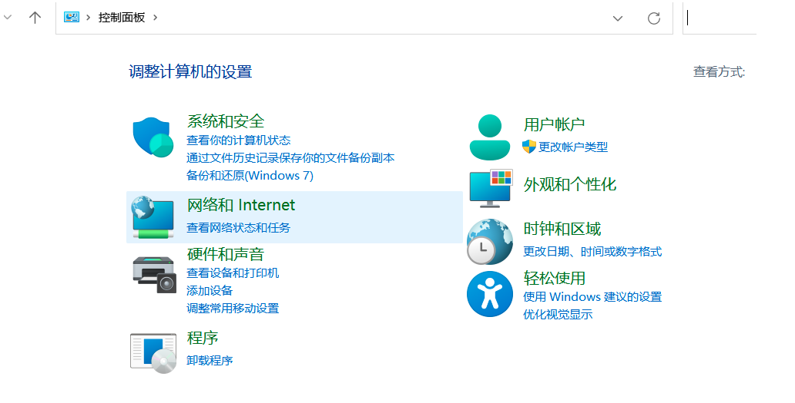

# clash for windows

鉴于clash github上删库了

在https://github.com/Mejituu/clash_for_windows_pkg/releases
https://github.com/Mejituu/clash/releases

有遗存的备份可供下载

1.下载后运行clash文件，会出现以下界面

2.选择左侧选项：Profiles

import或者download URL

再Update All

3.再回到clash-proxies界面

就可以选择想要切换科学上网的节点了（前提是有config.yaml）

后面的时间为延迟，点击右上角符号刷新

选取快的节点来使用（延时与购买或者搭建的机场节点有关）

4.如果是在windows系统下

4.1打开控制面板，选择网络和internet

4.2选择internet选项

4.3选择连接——局域网（LAN）设置——代理服务器

代理服务器全部都勾选

地址填：http://127.0.0.1 端口17890 或者 7890

*4.4如果不使用科学上网，即使用本地ip连接互联网，在本教程4.3代理服务器关掉所有勾选选项即可

5.测试：可用google网站测试是否链接上vpn

